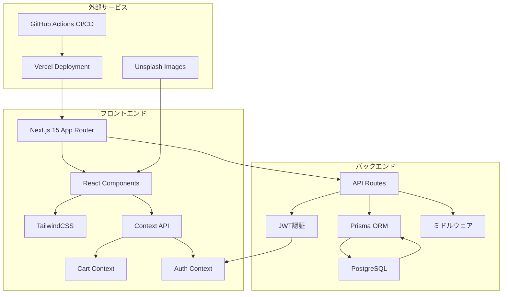
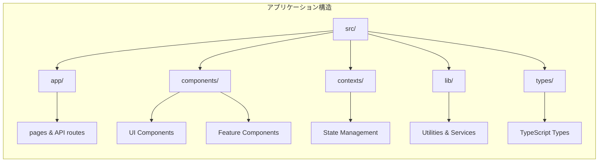
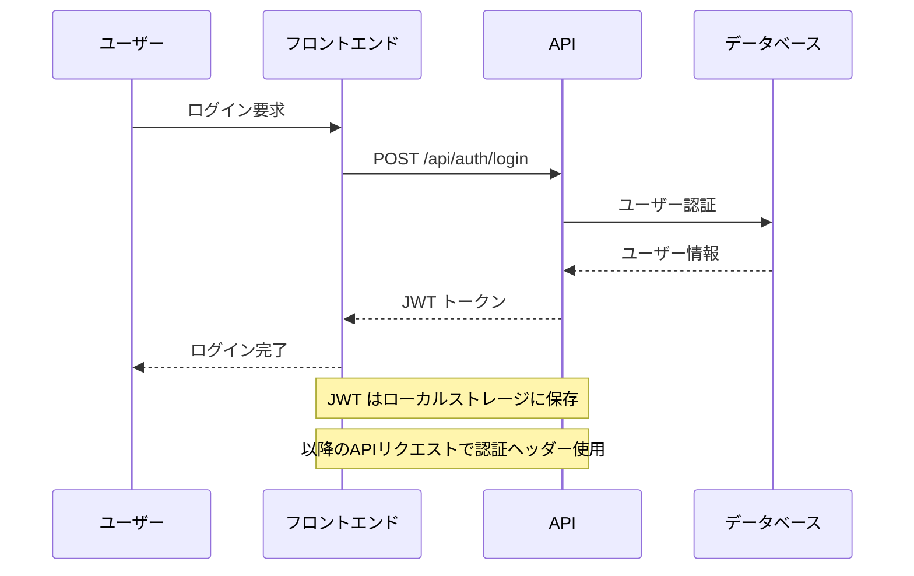
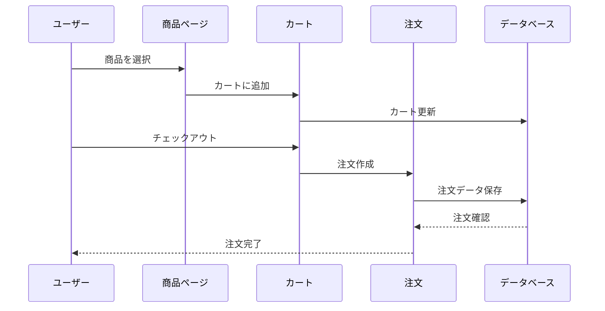
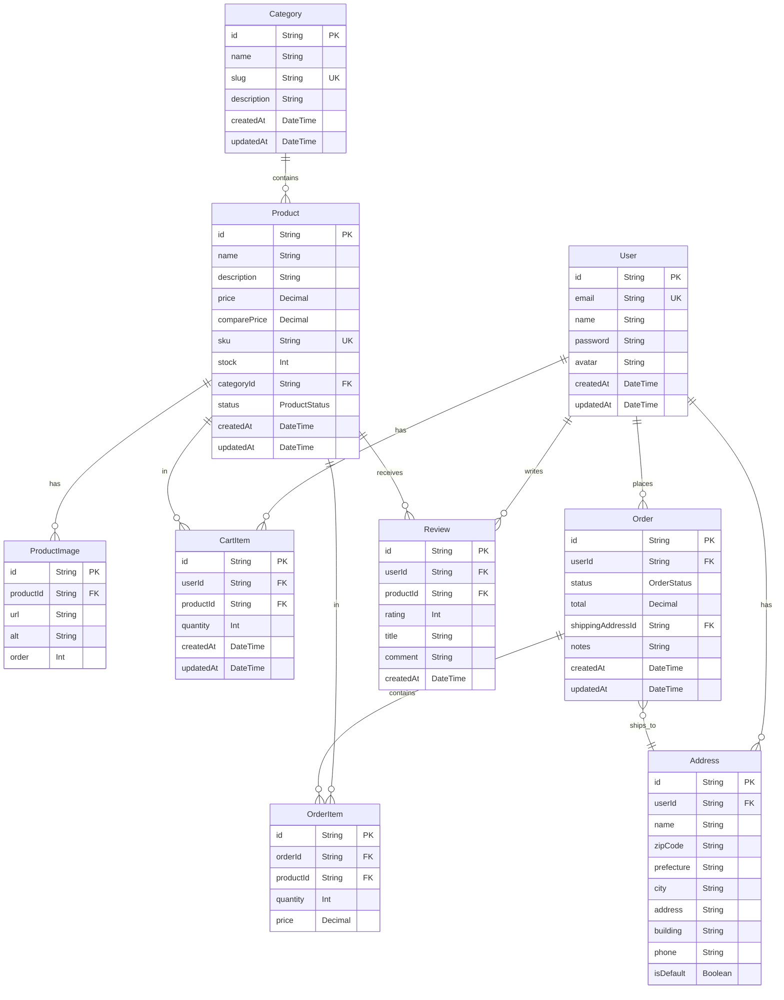
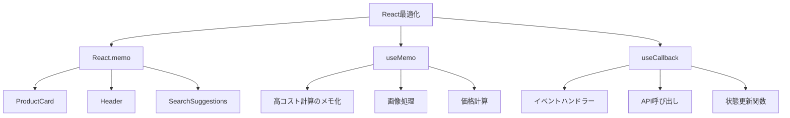
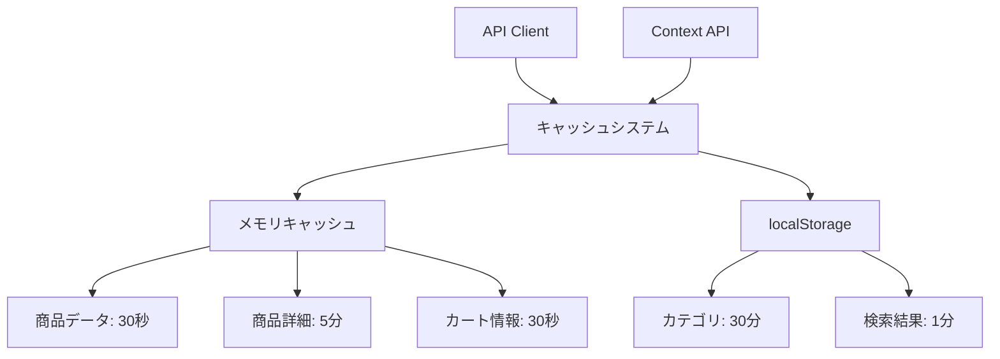
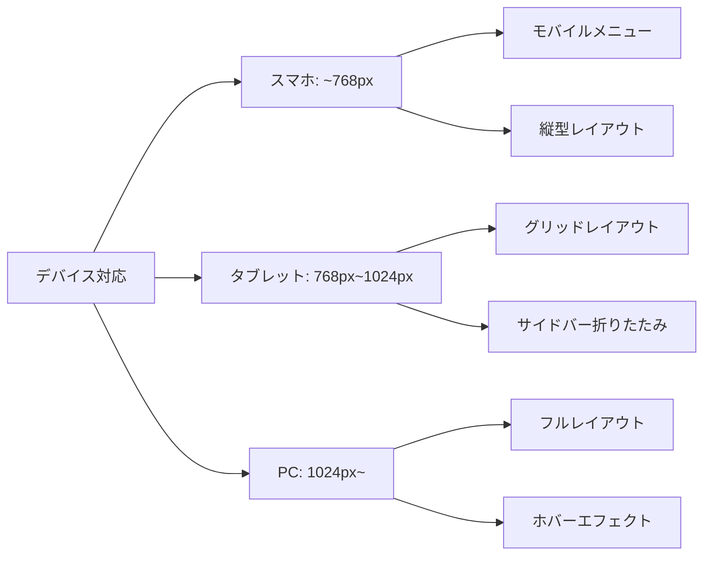
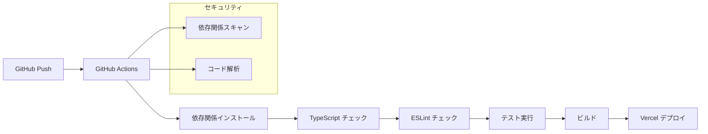

# ECストア - Amazon風ECサイト

モダンな技術スタックを使用して構築されたフルスタックECサイトです。Amazon風のUIデザインとUXを採用し、本格的なEコマース機能を提供します。

## 🌟 主な特徴

- **Amazon風UI/UX**: 使いやすいデザインとナビゲーション
- **フルスタック**: Next.js 15 App RouterとPrisma ORMによる完全なフルスタック実装
- **認証システム**: JWT認証による安全なユーザー管理
- **リアルタイム**: カート機能とリアルタイム在庫管理
- **レスポンシブデザイン**: モバイルファーストでPC/タブレット/スマホに対応
- **パフォーマンス最適化**: React.memo、キャッシュ戦略、バンドル最適化
- **CI/CD**: GitHub Actionsによる自動テストとデプロイ

## 🏗️ システムアーキテクチャ



## 🗂️ プロジェクト構造



## 🛒 主要機能フロー

### ユーザー認証フロー


### 商品購入フロー


## 🔧 技術スタック

### フロントエンド
- **Next.js 15**: React フレームワーク（App Router使用）
- **TypeScript**: 型安全性
- **TailwindCSS**: スタイリング
- **Lucide React**: アイコンライブラリ
- **React Hook Form**: フォーム管理

### バックエンド
- **Next.js API Routes**: サーバーサイドAPI
- **Prisma**: ORM（データベース操作）
- **PostgreSQL**: データベース
- **JWT**: 認証トークン
- **bcryptjs**: パスワードハッシュ化

### 開発・デプロイ
- **GitHub Actions**: CI/CD パイプライン
- **Vercel**: ホスティングプラットフォーム
- **ESLint & Prettier**: コード品質管理

## 📊 データベース設計



## 🚀 パフォーマンス最適化

### React最適化


### キャッシュ戦略


## 📱 レスポンシブデザイン



## 🔒 セキュリティ機能

- **JWT認証**: 安全なトークンベース認証
- **パスワードハッシュ化**: bcryptによるパスワード暗号化
- **CORS設定**: 適切なクロスオリジン制御
- **入力検証**: Zodによるバリデーション
- **SQLインジェクション対策**: Prisma ORMによる安全なクエリ

## 🛠️ 開発環境セットアップ

### 前提条件
- Node.js 18+
- PostgreSQL
- npm または yarn

### インストール

```bash
# リポジトリのクローン
git clone <repository-url>
cd ec

# 依存関係のインストール
npm install

# 環境変数の設定
cp .env.example .env
# .envファイルを編集してデータベース接続情報等を設定

# データベースのセットアップ
npx prisma migrate dev
npx prisma db seed

# 開発サーバーの起動
npm run dev
```

### 利用可能なスクリプト

```bash
npm run dev          # 開発サーバー起動
npm run build        # 本番ビルド
npm run start        # 本番サーバー起動
npm run lint         # ESLintチェック
npm run lint:fix     # ESLint自動修正
npm run type-check   # TypeScriptチェック
```

## 🔧 CI/CD パイプライン



## 📋 API エンドポイント

### 認証
- `POST /api/auth/login` - ユーザーログイン
- `POST /api/auth/register` - ユーザー登録
- `GET /api/auth/me` - 現在のユーザー情報取得

### 商品
- `GET /api/products` - 商品一覧取得
- `GET /api/products/[id]` - 商品詳細取得
- `GET /api/categories` - カテゴリ一覧取得

### カート
- `GET /api/cart` - カート内容取得
- `POST /api/cart` - カートに商品追加
- `PATCH /api/cart/[productId]` - カート内商品数量更新
- `DELETE /api/cart/[productId]` - カートから商品削除

### 注文
- `GET /api/orders` - 注文履歴取得
- `POST /api/orders` - 新規注文作成
- `GET /api/orders/[id]` - 注文詳細取得

## 🎯 今後の拡張予定

- [ ] 決済システム統合（Stripe等）
- [ ] 商品レビュー・評価システム
- [ ] ウィッシュリスト機能
- [ ] 商品推薦エンジン
- [ ] 管理者ダッシュボード
- [ ] 在庫管理システム
- [ ] メール通知機能
- [ ] PWA対応

## 📄 ライセンス

このプロジェクトはMITライセンスの下で公開されています。

## 🤝 コントリビューション

プルリクエストやイシューの報告を歓迎します。大きな変更を行う前に、まずイシューを作成して議論してください。

---

**開発者**: Claude Code Assistant  
**技術スタック**: Next.js 15, TypeScript, Prisma, PostgreSQL, TailwindCSS  
**デプロイ**: Vercel  
